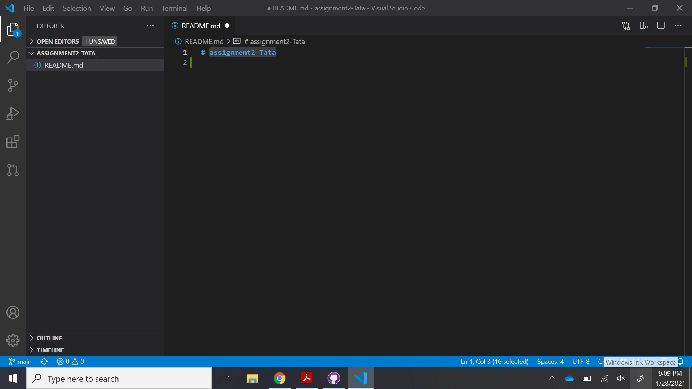
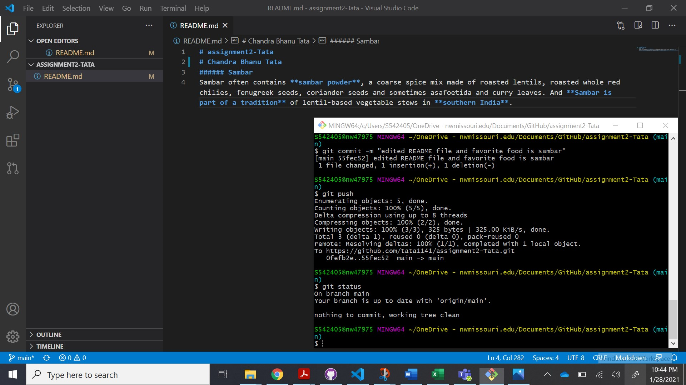
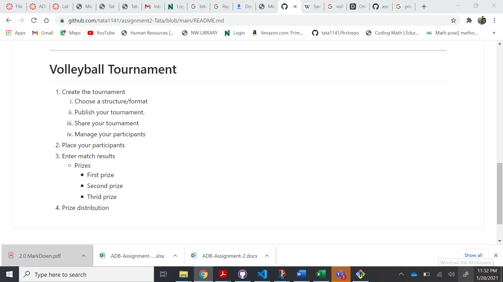
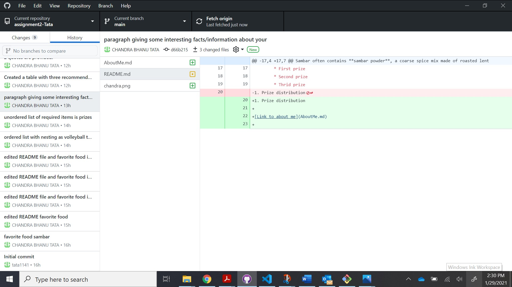
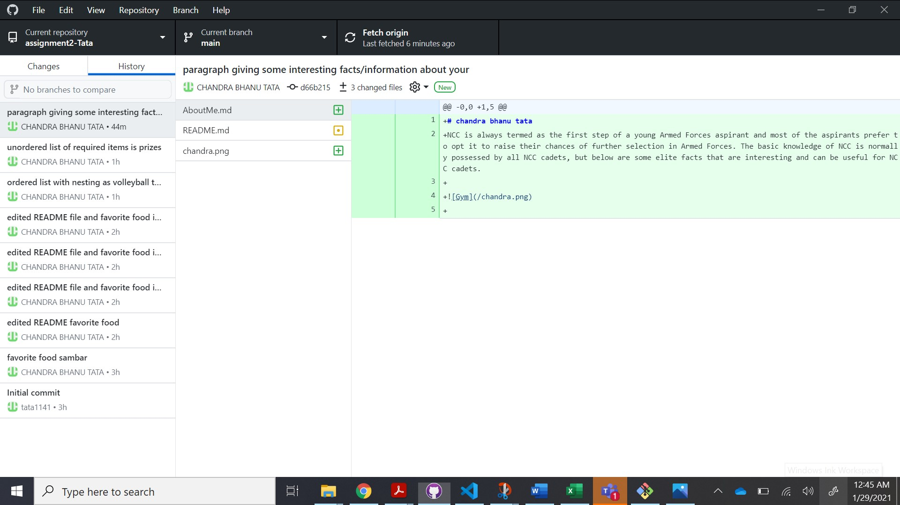
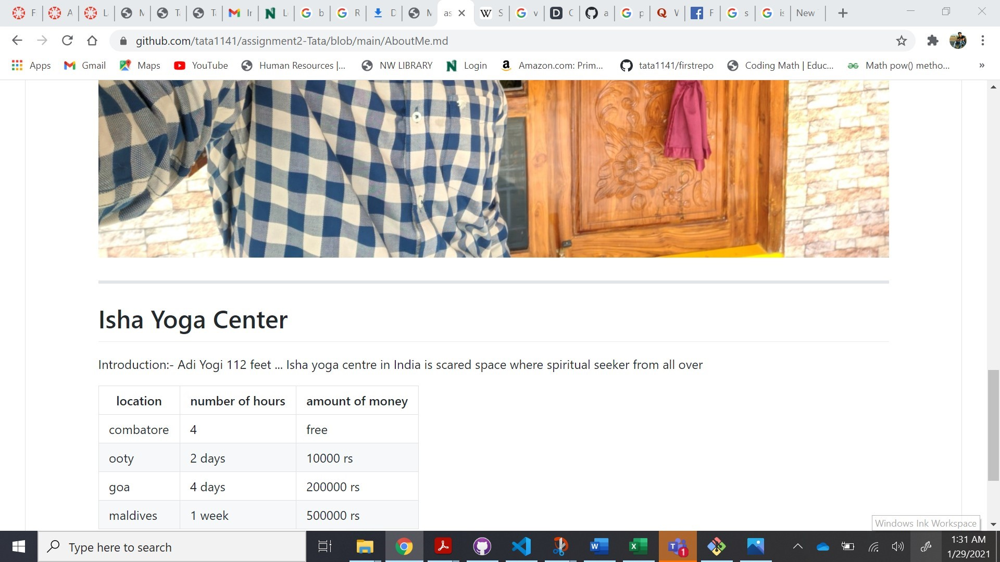
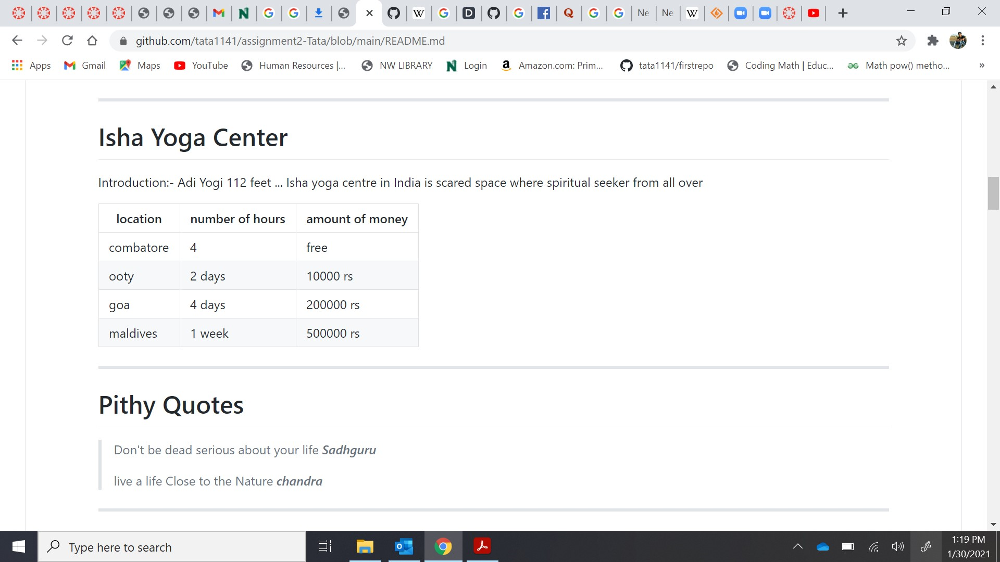
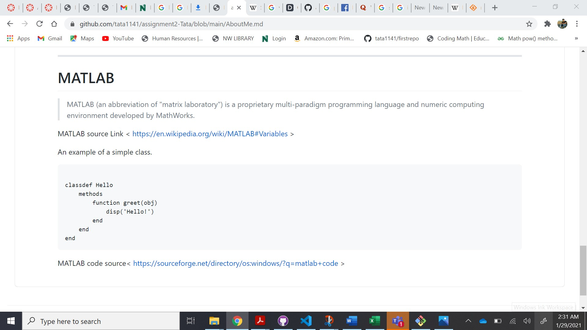

# assignment2-Tata
# Chandra Bhanu Tata
###### Sambar
Sambar often contains **sambar powder**, a coarse spice mix made of roasted lentils, roasted whole red chilies, fenugreek seeds, coriander seeds and sometimes asafoetida and curry leaves. And **Sambar is part of a tradition** of lentil-based vegetable stews in **southern India**. 

***

# Volleyball Tournament
1. Create the tournament
    1. Choose a structure/format
    2. Publish your tournament.
    3. Share your tournament
    4. Manage your participants
1. Place your participants
2. Enter match results
    * Prizes
        * First prize
        * Second prize
        * Thrid prize
1. Prize distribution

[Link to about me](AboutMe.md)

***

# Isha Yoga Center
Introduction:- Adi Yogi 112 feet ... Isha yoga centre in India is scared space where spiritual seeker from all over

| location | number of hours | amount of money |
| -------- | --------------- | --------------- |
| combatore | 4 | free |
| ooty | 2 days | 10000 rs |
| goa | 4 days | 200000 rs |
| maldives | 1 week | 500000 rs |

***

# Pithy Quotes
> Don't be dead serious about your life ***Sadhguru***
>
> live a life Close to the Nature ***chandra***

***

# MATLAB
> MATLAB (an abbreviation of "matrix laboratory") is a proprietary multi-paradigm programming language and numeric computing environment developed by MathWorks.

MATLAB source Link < https://en.wikipedia.org/wiki/MATLAB#Variables >

An example of a simple class.
```

classdef Hello
    methods
        function greet(obj)
            disp('Hello!')
        end
    end
end
```
MATLAB code source< https://sourceforge.net/directory/os:windows/?q=matlab+code >

---















